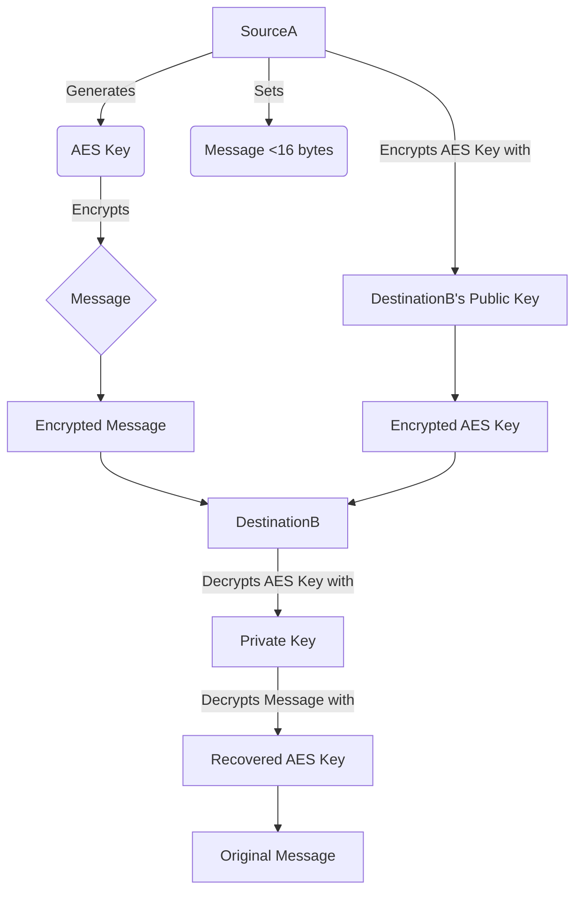

# README for llp115_crypto_system.py

## Overview
This project implements a cryptographic system using RSA and AES encryption algorithms. The system includes two main components: SourceA and DestinationB. SourceA encrypts a message using AES and then encrypts the AES key using RSA. DestinationB decrypts the AES key using RSA and then decrypts the message using AES.



## Files
- `llp115_crypto_system.py`: The main script containing the implementation of the cryptographic system.

## Dependencies
- `pycryptodome`: A self-contained Python package of low-level cryptographic primitives. Install it using:
  ```
  pip install pycryptodome
  ```

## Usage
1. Ensure you have the required dependencies installed.
2. Run the `llp115_crypto_system.py` script:
   ```
   python3.11 llp115_crypto_system.py
   ```
3. The script will generate a timestamped output file (e.g., `crypto_result_YYYYMMDD_HHMMSS.txt`) containing the following information:
   - Destination B's Public Key (hex)
   - Original Message
   - Message length
   - Original AES Key (hex)
   - Encrypted Message (hex)
   - Encrypted AES Key (hex)
   - Recovered Message
   - Recovered AES Key (hex)

## Functions
### `generate_rsa_keypair()`
Generates an RSA key pair for Destination B and prints the public key in hex format.

### `generate_aes_key(student_id)`
Generates an AES key based on a hashed random number seeded with the student ID.

### `SourceA`
- `__init__()`: Initializes the SourceA object.
- `set_message(message)`: Sets the message to be encrypted, ensuring it is less than 16 bytes.
- `encrypt_message(public_key)`: Encrypts the message using AES and the AES key using RSA.

### `DestinationB`
- `__init__(private_key)`: Initializes the DestinationB object with the private RSA key.
- `decrypt_data(encrypted_message, encrypted_key)`: Decrypts the AES key using RSA and the message using AES.


